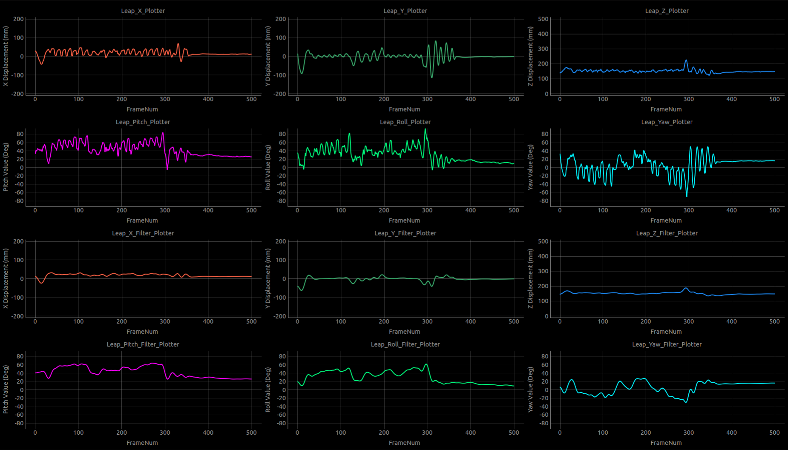

# LeapMotion Data Plotter and Filter
Created in 2016 by YunShuiXin
---

+ This is a small program filter the 6DOF data captured from Leap Motion
+ 
+ The six pictures above are original data from Leap Motion(position and rotation of hand), the six pictures below is the filtered data corresponding.
